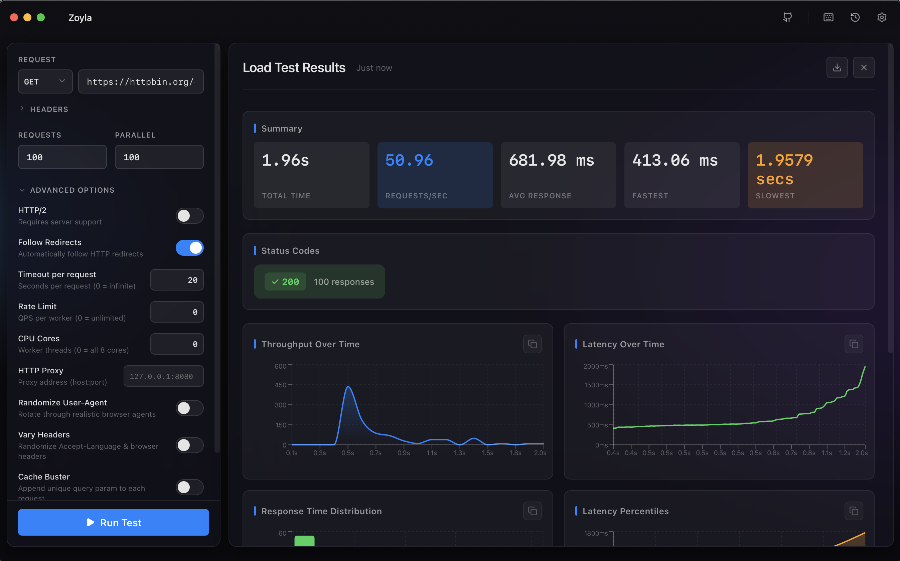

# Zoyla

Fast, lightweight HTTP load testing desktop application for quick, reliable performance insights.



## Overview

Zoyla is a desktop application that provides a simple, intuitive interface for running HTTP load tests without the complexity of enterprise testing suites.

## Target Users

Engineers who need quick, lightweight HTTP load testing:

- Backend developers testing API endpoints during development
- API owners validating endpoint performance and capacity
- SREs monitoring system behavior under load
- QA engineers performing quick performance validation
- Performance testers running rapid load tests without heavy tooling

## Why Zoyla?

Zoyla fills the gap between basic `curl` tests and full performance suites like JMeter or Gatling. It's ideal when you want:

- ⚡ Fast to run with minimal setup
- 🎯 Intuitive GUI without complex configuration files
- 🪶 Lightweight desktop app with efficient Rust backend
- 📊 Accurate performance measurements

## Common Questions Zoyla Answers

- How many requests per second can this endpoint handle?
- What happens when concurrency spikes?
- Does response time change after a code change?
- How does the system behave under sustained load?
- What's the latency distribution under load?
- How do different HTTP methods perform?

## Features

- Live updates during test execution
- RPS, latency percentiles, throughput, error rates
- Charts for throughput, latency, histograms, and correlations
- Save and replay previous test configurations
- HTTP/2 support, rate limiting, proxy configuration, header customization
- JSON and CSV export for further analysis

## Installation

Download the latest release for your platform from the [Releases page](https://github.com/behnamazimi/zoyla/releases) and install the desktop application.

### From Source

**Prerequisites:**

- [Node.js](https://nodejs.org/) (v18 or later)
- [Rust](https://www.rust-lang.org/tools/install) (latest stable)
- [Tauri prerequisites](https://tauri.app/start/prerequisites)

**Build:**

```bash
# Install dependencies
npm install

# Run in development mode
npm run tauri dev

# Build for production
npm run tauri build
```

## Quick Start

1. **Configure your test** - Enter the target URL, set requests and concurrency, configure HTTP method and headers
2. **Run the test** - Click "Run Test" or press `Cmd/Ctrl + Enter` to start
3. **Analyze results** - View real-time metrics, charts, and export results for further analysis

## Development

### Tech Stack

- **Frontend:** React + TypeScript + Vite + Zustand + vanilla-extract
- **Backend:** Rust (Tauri v2)
- **Charts:** Recharts
- **UI Components:** Radix UI

### Scripts

```bash
npm run dev          # Start development server
npm run build        # Build for production
npm run check-types  # Type check
npm run format       # Format code
npm run lint         # Lint and fix
npm run tauri dev    # Run Tauri in dev mode
npm run tauri build  # Build Tauri app
```

## Contributing

Contributions are welcome! Please feel free to submit a Pull Request.

## License

MIT License - see [LICENSE](LICENSE) file for details.

## Links

- **Repository:** [https://github.com/behnamazimi/zoyla](https://github.com/behnamazimi/zoyla)
- **Issues:** [https://github.com/behnamazimi/zoyla/issues](https://github.com/behnamazimi/zoyla/issues)

---

Made with ❤️ by [Behnam Azimi](https://github.com/behnamazimi)
